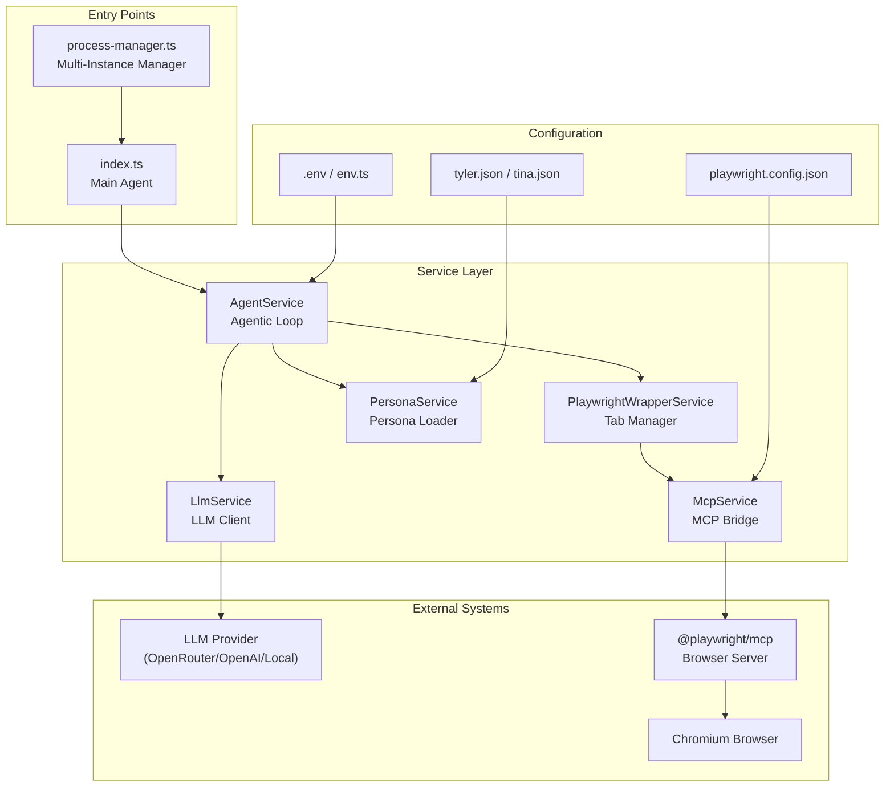
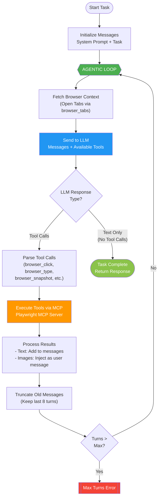
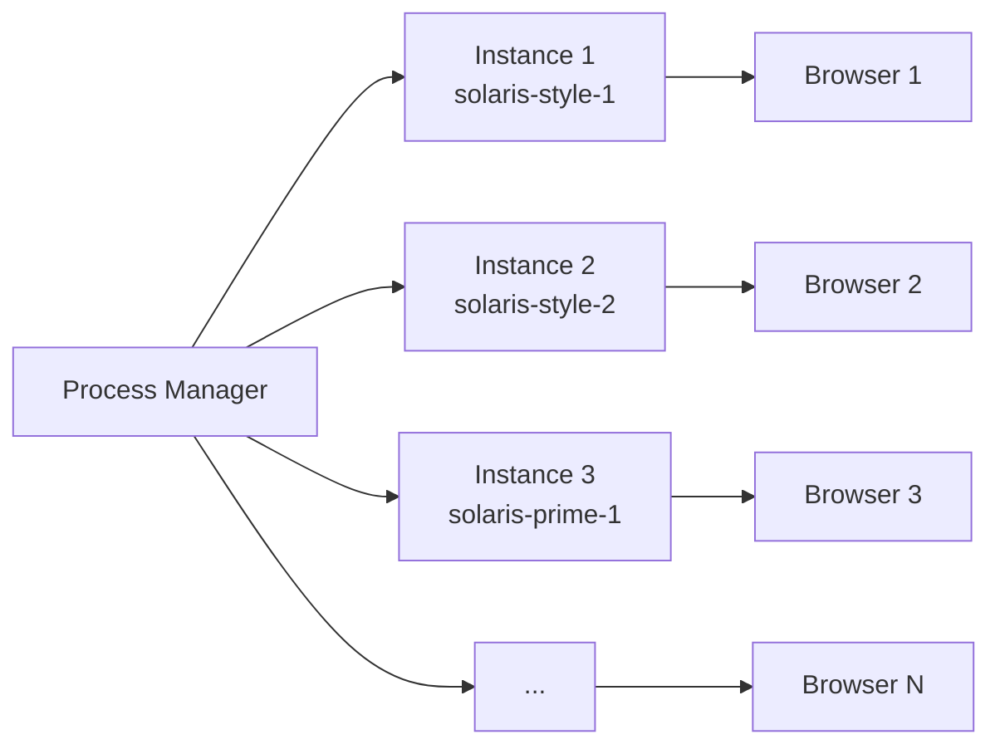

# Agentic Solaris

**An AI-powered autonomous survey automation agent using LLM + MCP + Playwright**

Agentic Solaris is a TypeScript-based autonomous agent that uses large language models (LLMs) to navigate websites, complete surveys, and interact with web forms. It leverages the Model Context Protocol (MCP) to bridge LLM reasoning with Playwright browser automation, creating a powerful "computer use" agentic system.

---

## Table of Contents

- [Architecture Overview](#-architecture-overview)
- [The Agentic Loop](#-the-agentic-loop---how-it-works)
- [Project Structure](#-project-structure)
- [Services](#-services)
- [Configuration](#-configuration)
- [Personas](#-personas)
- [Getting Started](#-getting-started)
- [Process Manager](#-process-manager)

---

## Architecture Overview



---

## The Agentic Loop - How It Works

The core of Agentic Solaris is its **agentic loop** - a continuous cycle where the LLM observes the browser state, decides what action to take, executes it via tools, and repeats until the task is complete.



### Loop Flow Explained

1. **Task Initialization**: A task (e.g., "Login to the website") is converted into a user message, combined with a system prompt containing instructions.

2. **Fetch Browser Context**: Before each LLM call, the agent fetches the current browser tab state to inject into the conversation.

3. **LLM Reasoning**: The full conversation history (with tools available) is sent to the LLM. The model decides whether to:
   - **Call tools**: Execute browser actions (click, type, navigate, take screenshot, etc.)
   - **Return text**: Task is complete, no more actions needed

4. **Tool Execution**: When the LLM requests tools, they're executed via the MCP bridge to Playwright. Results (text or images) are added back to the conversation.

5. **Context Management**: To prevent token bloat, old messages are pruned, keeping only the last 8 turns of conversation.

6. **Loop or Complete**: The loop continues until either:
   - The LLM responds with text only (task complete)
   - Maximum turns are reached (safety limit)

---

## Project Structure

```
agentic-solaris/
├── index.ts                    # Main entry point - survey workflow
├── process-manager.ts          # Multi-instance process orchestrator
├── package.json               # Dependencies
├── .sample.env                # Environment template
├── src/
│   ├── config/
│   │   ├── env.ts             # Zod-validated configuration
│   │   └── playwright.config.json  # Playwright MCP settings
│   ├── services/
│   │   ├── AgentService.ts    # Core agentic loop
│   │   ├── LlmService.ts      # OpenAI-compatible LLM client
│   │   ├── McpService.ts      # MCP connection to Playwright
│   │   ├── PlaywrightWrapperService.ts  # Tab/page management
│   │   └── PersonaService.ts  # Persona data loader
│   └── data/
│       ├── tyler.json         # Male persona
│       └── tina.json          # Female persona
└── output/                    # Screenshots and snapshots
```

---

## Services

### AgentService (Core Agentic Loop)

The heart of the system. Implements the observe-think-act loop:

- **`runTask(task)`**: Executes a natural language task by looping through LLM calls and tool executions
- **`checkIfComplete()`**: Analyzes browser state to determine if a survey is finished
- **Context Pruning**: Automatically truncates old messages to manage token limits
- **Token Tracking**: Monitors prompt/completion tokens for cost awareness

### McpService (MCP Bridge)

Connects to the Playwright MCP server:

- Spawns `@playwright/mcp` as a subprocess
- Translates LLM tool calls into Playwright browser actions
- Supports vision capabilities for screenshots
- Handles connection lifecycle (connect, restart, close)

### LlmService (LLM Client)

OpenAI-compatible client with resilience:

- Supports OpenRouter, local LLMs, or any OpenAI-compatible endpoint
- Exponential backoff retry for rate limits and network errors
- Configurable model and reasoning effort

### PlaywrightWrapperService (Tab Manager)

Intelligent browser session management:

- **Tab Limits**: Enforces maximum open tabs
- **Idle Timeout**: Auto-closes inactive tabs
- **Page Restart**: Restarts browser after N pages to prevent memory bloat
- **Activity Tracking**: Tracks last-active timestamp for each tab

### PersonaService (Persona Loader)

Loads and formats persona data for survey responses:

- Reads JSON persona files
- Formats persona attributes for LLM prompts
- Supports multiple personas (tyler, tina)

---

## Configuration

Copy `.sample.env` to `.env` and configure:

```bash
# Target site credentials
TARGET_EMAIL=your@email.com
TARGET_PASSWORD=yourpassword
TARGET_HOST=https://example.com

# LLM Configuration
LLM_BASE_URL=https://openrouter.ai/api/v1
LLM_API_KEY=your-api-key
MODEL_NAME=x-ai/grok-4.1-fast:free

# Survey behavior
SURVEY_STRATEGY=first_available  # shortest_available | highest_payout | first_available | random

# Runtime limits
MAX_PAGES=0                     # Max tabs (0 = unlimited)
RESTART_AFTER_PAGES=0           # Restart browser after N pages
PAGE_IDLE_TIMEOUT_MINUTES=10    # Close idle tabs after N minutes
RESTART_APP_AFTER_MINUTES=0     # Auto-restart app after N minutes

# Persona selection
PERSONA=tyler                   # tyler | tina
```

---

## Personas

Personas provide consistent survey responses. Each persona is a detailed JSON profile with:

| Category | Attributes |
|----------|-----------|
| Demographics | Age, gender, location, race, religion |
| Employment | Job title, employer, salary, industry |
| Financial | Bank, credit cards, investments |
| Health | Height, weight, diet, health concerns |
| Lifestyle | Social media, shopping, subscriptions |
| Consumer | Brand affinities, purchase intent, preferences |

The agent uses these attributes to answer survey questions consistently.

---

## Getting Started

### Prerequisites

- [Bun](https://bun.sh/) runtime
- Node.js 18+ (for npx)
- An LLM API key (OpenRouter, OpenAI, or local)

### Installation

```bash
# Clone the repository
git clone https://github.com/yourusername/agentic-solaris.git
cd agentic-solaris

# Install dependencies
bun install

# Install Playwright browsers
bunx playwright install chromium

# Configure environment
cp .sample.env .env
# Edit .env with your credentials
```

### Running

```bash
# Single instance
bun run index.ts

# Multiple instances (production)
bun run process-manager.ts
```

---

## Process Manager

For production use, `process-manager.ts` orchestrates multiple agent instances:

- **Staggered Startup**: Instances start with delays to avoid resource spikes
- **Auto-Restart**: Failed instances restart automatically
- **Multiple Configs**: Different `.env` files for different accounts
- **Graceful Shutdown**: Handles SIGINT/SIGTERM properly



---

## Key Concepts

### Computer Use via MCP

This project demonstrates "computer use" - where an LLM controls a computer through tool calls:

1. **LLM as Brain**: The LLM decides what to do based on the current browser state
2. **MCP as Bridge**: Model Context Protocol provides a standardized way to expose browser tools
3. **Playwright as Hands**: Executes actual browser automation

### Vision Capabilities

The agent can "see" the browser through:

- **Accessibility Snapshots**: Structured DOM representation via `browser_snapshot`
- **Screenshots**: Visual captures for CAPTCHAs and visual elements
- **Coordinate Clicks**: `browser_mouse_click_xy` for precise interactions

### Resilience Features

- **Retry Logic**: LLM calls retry with exponential backoff
- **Context Pruning**: Prevents token limit exhaustion
- **Error Recovery**: Agent can recover from navigation errors
- **Tab Cleanup**: Automatic cleanup of stale browser tabs

---

## License

This project is for educational and research purposes.

---

## Acknowledgments

- [Model Context Protocol](https://modelcontextprotocol.io/) by Anthropic
- [@playwright/mcp](https://github.com/playwright-community/playwright-mcp) for browser automation
- [OpenRouter](https://openrouter.ai/) for LLM access
